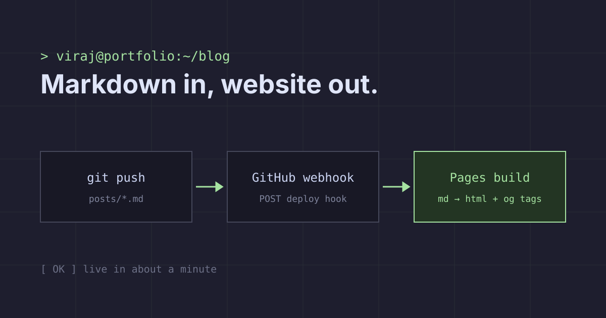

This is a sample post from the blog starter. Replace it with your own writing — everything below exists to exercise the pipeline: headings, code, tables, images and links.

## How a post goes live



1. Write `posts/<slug>.md` with a little frontmatter.
2. `git push` to `main`.
3. A GitHub Action calls the Cloudflare Pages **deploy hook**.
4. The build clones this repo, renders Markdown to HTML, and pre-renders a page per post with its own link preview.

## Frontmatter

| Field         | Required | Notes                                         |
| ------------- | -------- | --------------------------------------------- |
| `title`       | yes      | Shown on cards and in link previews           |
| `date`        | yes      | `YYYY-MM-DD` — posts are sorted newest first  |
| `description` | no       | Falls back to the first paragraph             |
| `tags`        | no       | `[ai, backend]`                               |
| `cover`       | no       | Relative PNG/JPG path, used as `og:image`     |
| `draft`       | no       | `true` keeps the post out of production       |

## Code blocks

Syntax highlighting happens at build time, so no highlighter ships to the browser:

```ts
export async function getPost(slug: string) {
  const res = await fetch(`/blog/posts/${slug}.json`);
  return res.ok ? ((await res.json()) as Post) : null;
}
```

```bash
# preview posts locally from a checkout of this repo
BLOG_DIR=../blog npm run dev
```

### Inline bits

Inline `code`, **bold**, _italics_, ~~strikethrough~~, and a [link to the other sample post](./writing-locally.md).

> Tip: images next to your posts are copied into the site at build time, so relative paths just work.

- [x] Markdown in a repo
- [x] Rebuild on push
- [ ] Write the first real post
